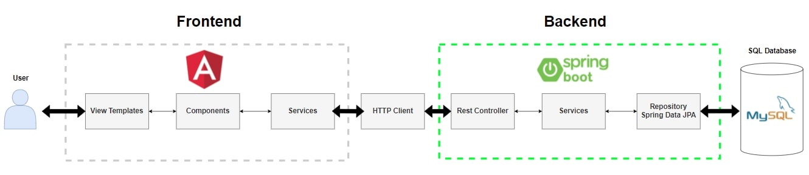

# Twitter Clone Backend Demo Web Application

## Table of contents
* [General info](#general-info)
* [Technologies](#technologies)
* [Dependencies](#dependencies)
* [Entity Reliationship Diagram](#entity-relationship-diagram)
* [Features](#features)
* [Status](#status)

## General info

## Technologies
* Java - version  17 LTS
* Spring Boot - version 2.5.7
* MySQL - version 8.0

## Dependencies
1. Developer Tools
    - Lombok
2. WEB
    - Spring Web
3. SQL
    - MySql Driver
    - H2 Database
    - Spring Data JPA
4. Security
    - Spring Security
    - JWT
5. I/O
    - Java Mail Sender
6. Document API
    - Springfox Swagger 3.0.0
7. Messaging
    - WebSocket
8. Testing
    - JUnit 5
    - AssertJ
    - Mockito
9. Additional
    - TimeAgo - library for displaying dates as relative time ago language

## Entity Relationship Diagram

## Features
- authentication
  - sign up with email confirmation
  - login authentication
- user profile:
  - update user profile
  - check selected user profile
  - follow/unfollow user
- posts:
  - add posts
  - delete posts
  - update posts / not implemented
- comments:
  - add comments to posts

## Status
Project is: _in progress_ / _suspended_
